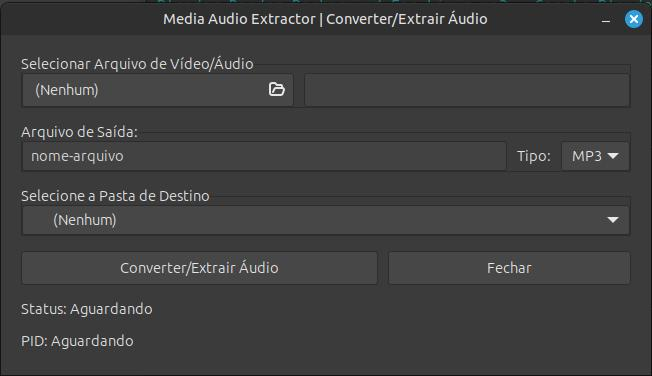

# Media Audio Extractor

Media Audio Extractor é uma aplicação GTK que permite converter e extrair áudio de arquivos de vídeo e áudio.




## Pré-requisitos

- Python 3.x
- GTK 3.x
- ffmpeg

## Instalação

1. Clone o repositório:
   ```bash
   git clone https://github.com/seu-usuario/media-audio-extractor.git

2. **LICENSE**:

Você pode usar um gerador de licenças como [choosealicense.com](https://choosealicense.com/) para criar um arquivo de licença MIT.

3. **requirements.txt**:

```plaintext
````
PyGObject

# Byte-compiled / optimized / DLL files
__pycache__/
*.py[cod]

# Virtual environment
venv/

# System files
.DS_Store

# IDE files
.idea/
*.swp
